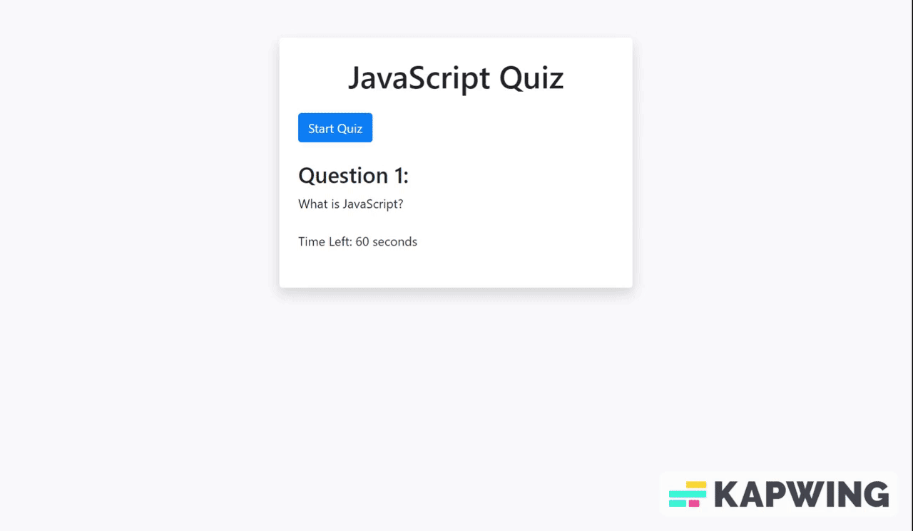

# Javascript Quiz
## Description

The goal for this project was to create a quiz where users can test their knowledge on the programming language Javascript. The goal was to alllow users to not only test their knowledge but also compete for a good score. To do this the score is saved to loacal storage and allows the user to input their initials so that when the score is saved it also saves their initials so they can show others how well they did. I utilized bootstrap to assist with the styling as well as fundamental knowledge of javascript to execute the programming aspect of the code, so that it was adherent to user input.

# Installation

N/A

## Usage

## Credits

N/A

## License

N/A

## Features
Timer 

Bootstrap

Response checker for correct and incorrect answers

Reactive css styling

Scoreboard saved via LocalStorage
